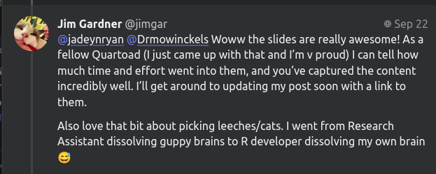
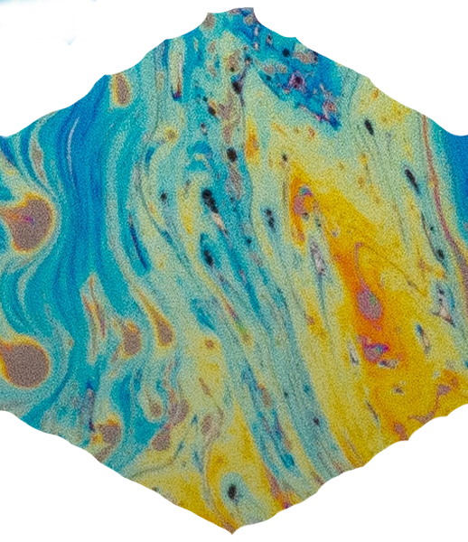
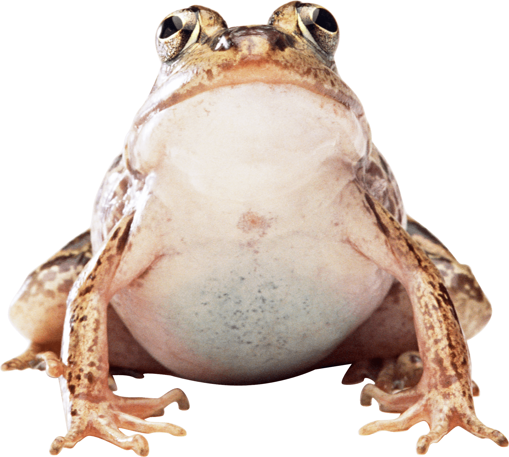
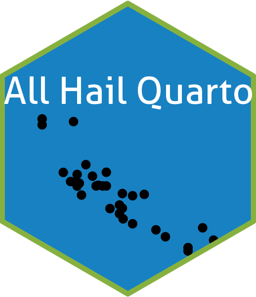
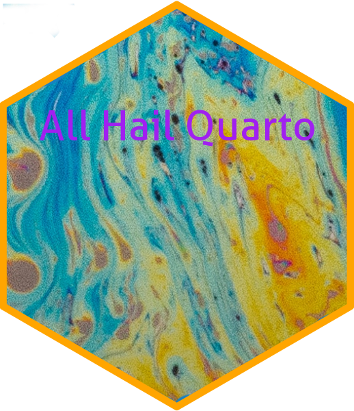
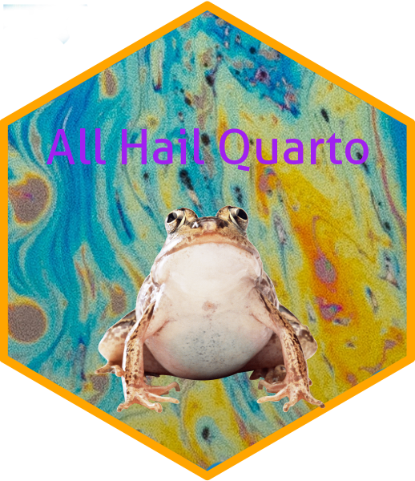
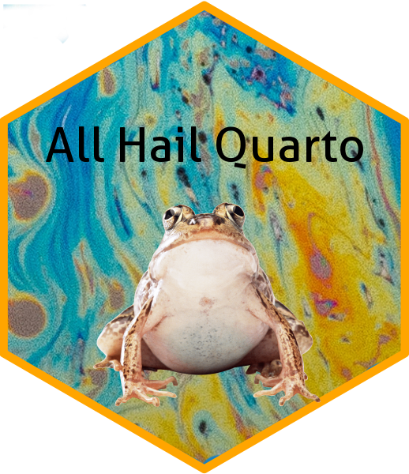
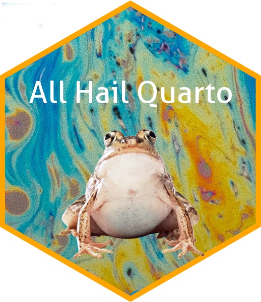

Quartoads Hex Sticker
================

**Quartoads** are those who may be a little obsessed with using
#QuartoPub for everything and anything.

The term was proposed by [Jim Gardner](https://fosstodon.org/@jimgar),
and then [Adam Austin](https://fosstodon.org/@ataustin) proposed that
there needed to be a hex sticker (because nothing truly exists in R
without a hex sticker).

``` r

```


``` r

```


When I read the hex sticker post, a long with **Quartoads**, I
immediately thought of Hypnotoad from Futurama (even though I’ve hardly
watched any Futurama). I had some free time, and thought the hex sticker
idea was a great one, so I tried my hand at making one.

I found a toad photo on [Pure
PNG](https://purepng.com/photo/511/animals-brown-toad), and a trippy
earth photo that I could cut a background out of on
[Unsplash](https://unsplash.com/photos/fazB8Al_LnE).

I used the [hexSticker](https://github.com/GuangchuangYu/hexSticker)
package to create a hex template that I could fit the colorful
background onto.

So now we have all our components.

The background.

``` r

```


The toad.

``` r

```


And the ability to make a hex sticker.

``` r
library(hexSticker)
library(ggplot2)
p = ggplot(aes(x = mpg, y = wt), data = mtcars) + geom_point()
p = p + theme_void() + theme_transparent()
sticker(p, package = "All Hail Quarto", p_size=20, s_x=1, s_y=.75, s_width=1.3, s_height=1,
filename = "figures/ggplot2_hex_example.png")

```


## Making the Hex

We will use the `hexSticker` package to add the text and our trippy
background image, and then combine that with the `magick` package to add
the toad on top.

Let’s get the initial bits on.

``` r
sticker("resources/trippy_background.png", package = "All Hail Quarto", p_size = 16, p_color = "purple", 
        filename = "figures/base_hex.png", 
        s_x = 1, s_y = 1, s_width = 0.85, h_color = "orange")

```


And read the image back in, as well as the toad using `magick`.

``` r
library(magick)
```

    Linking to ImageMagick 6.9.11.60
    Enabled features: fontconfig, freetype, fftw, heic, lcms, pango, webp, x11
    Disabled features: cairo, ghostscript, raw, rsvg

    Using 8 threads

``` r
base_hex = image_read("figures/base_hex.png")
toad_img = image_read("resources/toad.png")
```

And then we need to resize the toad.

``` r
toad_scale = image_scale(toad_img, "288x")
```

Now we should be able to put them together.

``` r
toad_moved = image_extent(toad_scale, "525x770")
combined_hex = c(base_hex, toad_moved)
flattened_purple = image_flatten(combined_hex)
```

``` r
image_write(flattened_purple, path = "stickers/quartoad_hex_purple.png")

```


This doesn’t look too bad, and this is what I posted initially. But the
purple text is kind of hard to read. Maybe we should try another color.

``` r
sticker("resources/trippy_background.png", package = "All Hail Quarto", p_size = 16, p_color = "black", 
        filename = "figures/base_hex_black.png", 
        s_x = 1, s_y = 1, s_width = 0.85, h_color = "orange")
base_black = image_read("figures/base_hex_black.png")
combined_black = c(base_black, toad_moved)
flattened_black = image_flatten(combined_black)
```

``` r
image_write(flattened_black, path = "stickers/quartoad_hex_black.png")

```


This text is definitely much more legible. What about white??

``` r
sticker("resources/trippy_background.png", package = "All Hail Quarto", p_size = 16, p_color = "white", 
        filename = "figures/base_hex_white.png", 
        s_x = 1, s_y = 1, s_width = 0.85, h_color = "orange")
base_white = image_read("figures/base_hex_white.png")
combined_white = c(base_white, toad_moved)
flattened_white = image_flatten(combined_white)
```

``` r
image_write(flattened_white, path = "stickers/quartoad_hex_white.png")

```


## License

All images are licensed CC0. Download, remix, revamp, do whatever you
want with them. Use the code above to make different versions if you
want to.
